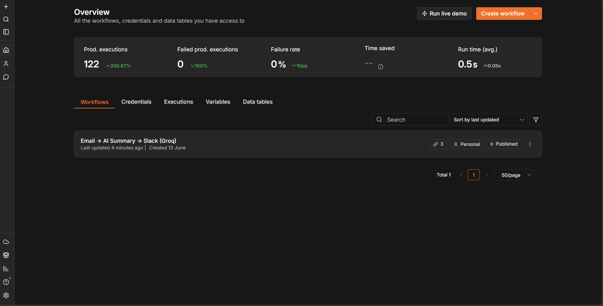
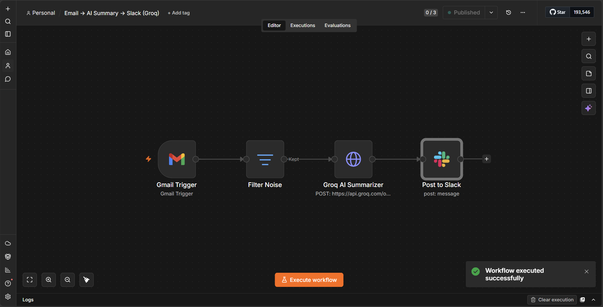
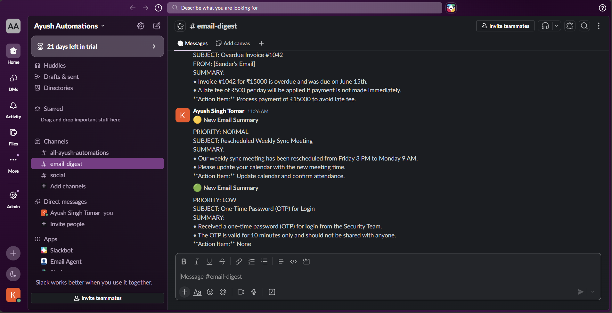

# n8n Email to Slack — AI Email Summarizer

An automation workflow that reads Gmail emails, summarizes them using Groq AI, and posts the summary to a Slack channel — fully automated, runs every minute.

## 🎥 Demo Video

https://github.com/user-attachments/assets/14e81b8f-24d5-429d-87e4-c2d8aa7955a5

## 🌐 Live Demo

Workflow running on n8n.cloud — connects Gmail → Groq AI → Slack automatically.
[ayush22.app.n8n.cloud](https://ayush22.app.n8n.cloud)

---

## 📊 Stats

---

## 🔄 Workflow

---

## 💬 Slack Output

---

## 🖼️ Screenshots

| | | |
|---|---|---|
|  |  |  |

## 🎞️ Demo GIF

---

## ⚙️ How It Works

1. **Gmail Trigger** — Polls Gmail every minute for new emails
2. **Filter Noise** — Blocks OTPs, spam, and verification emails automatically
3. **Groq AI Summarizer** — Summarizes email using llama-3.1-8b-instant model
4. **Post to Slack** — Sends formatted summary to #email-digest channel with priority emoji

### Priority System

- 🔴 URGENT — Immediate action required
- 🟡 NORMAL — Standard emails
- 🟢 LOW — FYI / no action needed

---

## 🛠️ Setup

1. Import `workflow/workflow.json` into your n8n instance
2. Add credentials:
   - Gmail OAuth2
   - Slack OAuth2
   - Groq API key
3. Set Slack channel to `#email-digest`
4. Activate the workflow

---

## 🔇 Noise Filter

Automatically blocks emails containing:

- OTP / one-time password
- Security code / verification
- Unsubscribe / no-reply
- Password reset

---

## 🧰 Tech Stack

| Tool | Purpose |
|------|---------|
| n8n | Workflow automation |
| Gmail API | Email trigger |
| Groq API | AI summarization |
| llama-3.1-8b-instant | LLM model |
| Slack API | Notifications |